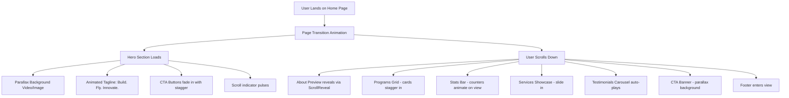
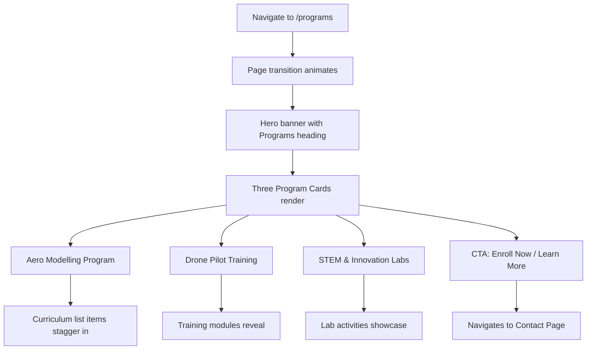
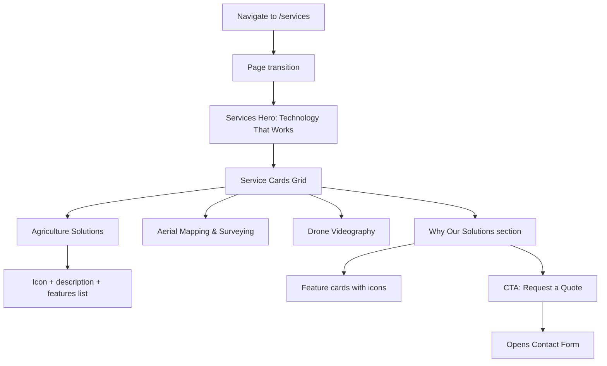
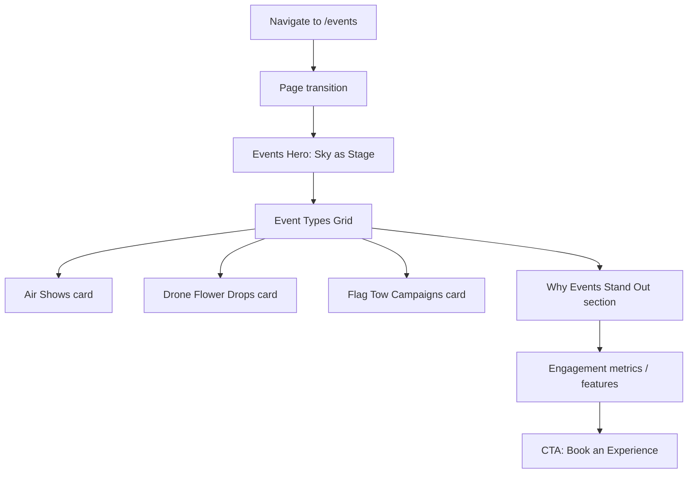
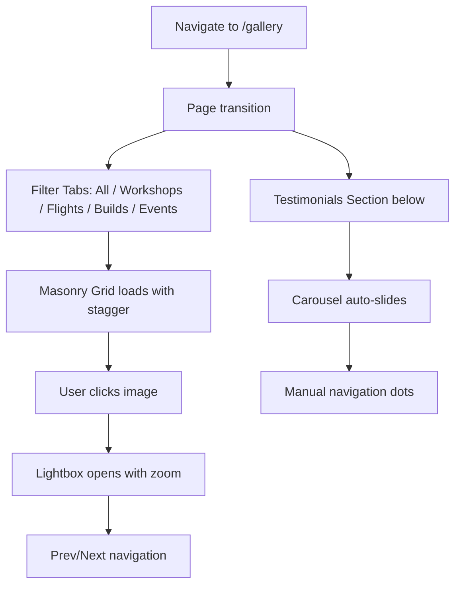
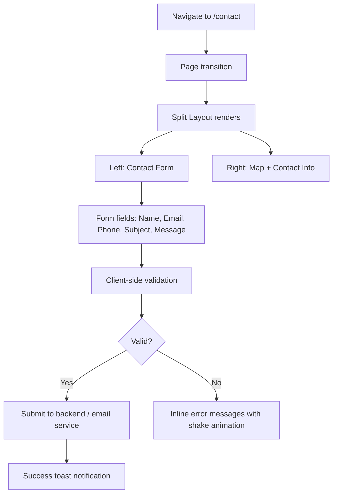
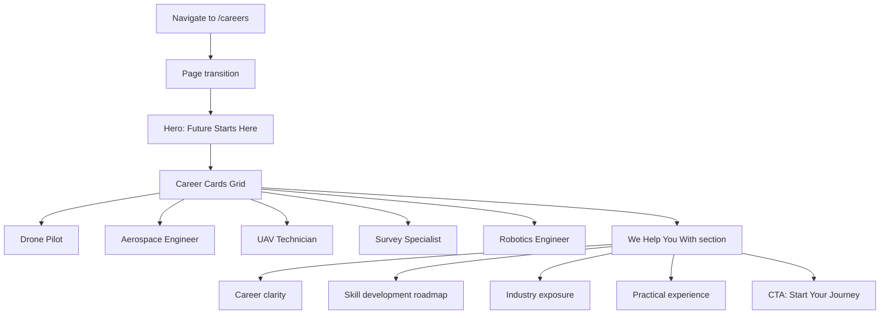
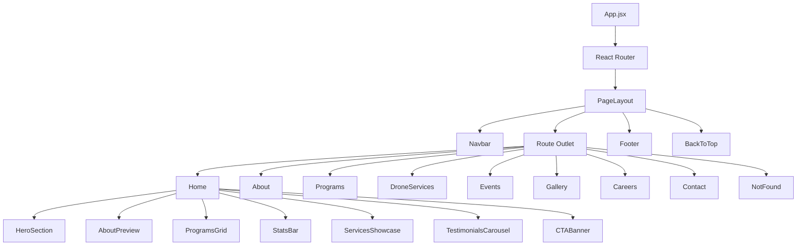
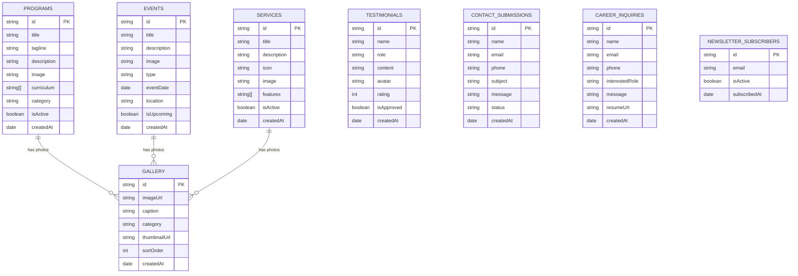

# 🛩️ Madras Aero Club — Complete Project Plan & Architecture

> **Tagline:** Build. Fly. Innovate.
> **Stack:** React 18 · JavaScript · Framer Motion · Vite · Vanilla CSS
> **Created:** 2026-03-20

---

## 📑 Table of Contents

1. [Project Overview](#1-project-overview)
2. [Folder Structure](#2-folder-structure)
3. [Module Breakdown](#3-module-breakdown)
4. [Detailed Workflow Per Module](#4-detailed-workflow-per-module)
5. [Frontend Architecture](#5-frontend-architecture)
6. [Backend Architecture (Optional/Future)](#6-backend-architecture)
7. [Database Structure & Relationships](#7-database-structure--relationships)
8. [Step-by-Step Implementation Plan](#8-step-by-step-implementation-plan)
9. [Missing Components & Improvements](#9-missing-components--improvements)
10. [Design System & Tokens](#10-design-system--tokens)

---

## 1. Project Overview

**Madras Aero Club** is a modern, visually stunning, and performance-optimized website for an aerospace learning and drone technology organization. The website showcases:

- **Educational Programs** — Aero Modelling, Drone Pilot Training, STEM Labs
- **Commercial Drone Services** — Agriculture, Mapping, Videography
- **Events & Aerial Experiences** — Air Shows, Drone Flower Drops, Flag Tow Campaigns
- **Career Pathways** — Industry career guidance and skill development
- **Gallery & Testimonials** — Visual showcase of workshops, flights, and builds
- **Contact & Engagement** — Lead capture and inquiry forms

### Tech Stack Rationale

| Technology | Purpose |
|---|---|
| **React 18** | Component-based UI, fast rendering via virtual DOM |
| **JavaScript (ES2022+)** | Core logic, no TypeScript overhead for this project scope |
| **Framer Motion** | Premium micro-animations, page transitions, scroll-triggered reveals |
| **Vite** | Lightning-fast dev server and optimized production builds |
| **Vanilla CSS** (CSS Modules) | Maximum control, no utility-class bloat, scoped styles |
| **React Router v6** | Client-side routing with nested layouts |

---

## 2. Folder Structure

```
MadrasAeroClub/
│
├── public/                          # Static assets served as-is
│   ├── favicon.ico                  # Browser tab icon
│   ├── og-image.jpg                 # Social media share preview
│   ├── robots.txt                   # SEO crawling rules
│   ├── sitemap.xml                  # SEO sitemap
│   └── images/                      # Static images (logos, backgrounds)
│       ├── logo.svg                 # Main logo (SVG for crispness)
│       ├── logo-white.svg           # White variant for dark sections
│       ├── hero/                    # Hero section backgrounds
│       ├── programs/                # Program-specific imagery
│       ├── services/                # Drone services imagery
│       ├── events/                  # Events & air show photos
│       ├── gallery/                 # Gallery grid images
│       ├── team/                    # Team member photos
│       └── careers/                 # Career page visuals
│
├── src/                             # Application source code
│   │
│   ├── main.jsx                     # App entry point — mounts <App/>
│   ├── App.jsx                      # Root component — routing + layout
│   ├── App.css                      # Global app-level styles
│   │
│   ├── assets/                      # Imported assets (bundled by Vite)
│   │   ├── icons/                   # Custom SVG icon components
│   │   │   ├── ArrowRight.jsx
│   │   │   ├── Drone.jsx
│   │   │   ├── Plane.jsx
│   │   │   ├── Rocket.jsx
│   │   │   └── index.js            # Barrel export
│   │   ├── fonts/                   # Custom web fonts (if self-hosted)
│   │   └── videos/                  # Background/hero video assets
│   │
│   ├── styles/                      # Global design system
│   │   ├── variables.css            # CSS custom properties (colors, spacing, fonts)
│   │   ├── reset.css                # CSS reset / normalize
│   │   ├── typography.css           # Global typography rules
│   │   ├── animations.css           # Reusable CSS keyframe animations
│   │   └── index.css                # Main entry — imports all above
│   │
│   ├── components/                  # Reusable UI components
│   │   ├── layout/                  # Structural layout components
│   │   │   ├── Navbar/
│   │   │   │   ├── Navbar.jsx       # Main navigation bar
│   │   │   │   ├── Navbar.module.css
│   │   │   │   ├── MobileMenu.jsx   # Hamburger slide-out menu
│   │   │   │   └── MobileMenu.module.css
│   │   │   ├── Footer/
│   │   │   │   ├── Footer.jsx       # Site footer with links & socials
│   │   │   │   └── Footer.module.css
│   │   │   ├── PageLayout/
│   │   │   │   ├── PageLayout.jsx   # Shared page wrapper (Navbar+Footer)
│   │   │   │   └── PageLayout.module.css
│   │   │   └── Section/
│   │   │       ├── Section.jsx      # Reusable full-width section wrapper
│   │   │       └── Section.module.css
│   │   │
│   │   ├── ui/                      # Atomic/reusable UI elements
│   │   │   ├── Button/
│   │   │   │   ├── Button.jsx       # Primary/Secondary/Ghost button
│   │   │   │   └── Button.module.css
│   │   │   ├── Card/
│   │   │   │   ├── Card.jsx         # Content card (programs, services)
│   │   │   │   └── Card.module.css
│   │   │   ├── SectionHeading/
│   │   │   │   ├── SectionHeading.jsx  # Animated heading + subtitle
│   │   │   │   └── SectionHeading.module.css
│   │   │   ├── Badge/
│   │   │   │   ├── Badge.jsx        # Tag/label badges
│   │   │   │   └── Badge.module.css
│   │   │   ├── TestimonialCard/
│   │   │   │   ├── TestimonialCard.jsx
│   │   │   │   └── TestimonialCard.module.css
│   │   │   ├── StatCounter/
│   │   │   │   ├── StatCounter.jsx  # Animated number counter
│   │   │   │   └── StatCounter.module.css
│   │   │   ├── ImageGallery/
│   │   │   │   ├── ImageGallery.jsx # Lightbox-enabled masonry grid
│   │   │   │   └── ImageGallery.module.css
│   │   │   ├── ContactForm/
│   │   │   │   ├── ContactForm.jsx  # Multi-field contact form
│   │   │   │   └── ContactForm.module.css
│   │   │   ├── ScrollReveal/
│   │   │   │   └── ScrollReveal.jsx # Framer Motion scroll-triggered wrapper
│   │   │   ├── Loader/
│   │   │   │   ├── Loader.jsx       # Page/route loading animation
│   │   │   │   └── Loader.module.css
│   │   │   └── BackToTop/
│   │   │       ├── BackToTop.jsx    # Floating scroll-to-top button
│   │   │       └── BackToTop.module.css
│   │   │
│   │   └── sections/                # Page-level section components
│   │       ├── HeroSection/
│   │       │   ├── HeroSection.jsx  # Full-viewport hero with parallax
│   │       │   └── HeroSection.module.css
│   │       ├── AboutPreview/
│   │       │   ├── AboutPreview.jsx # Home page about snippet
│   │       │   └── AboutPreview.module.css
│   │       ├── ProgramsGrid/
│   │       │   ├── ProgramsGrid.jsx # 3-column program cards
│   │       │   └── ProgramsGrid.module.css
│   │       ├── ServicesShowcase/
│   │       │   ├── ServicesShowcase.jsx
│   │       │   └── ServicesShowcase.module.css
│   │       ├── EventsHighlight/
│   │       │   ├── EventsHighlight.jsx
│   │       │   └── EventsHighlight.module.css
│   │       ├── StatsBar/
│   │       │   ├── StatsBar.jsx     # Animated statistics ribbon
│   │       │   └── StatsBar.module.css
│   │       ├── CTABanner/
│   │       │   ├── CTABanner.jsx    # Call-to-action full-width banner
│   │       │   └── CTABanner.module.css
│   │       ├── TestimonialsCarousel/
│   │       │   ├── TestimonialsCarousel.jsx
│   │       │   └── TestimonialsCarousel.module.css
│   │       └── CareerPaths/
│   │           ├── CareerPaths.jsx  # Career listing cards
│   │           └── CareerPaths.module.css
│   │
│   ├── pages/                       # Route-level page components
│   │   ├── Home/
│   │   │   ├── Home.jsx             # Landing page — hero + previews
│   │   │   └── Home.module.css
│   │   ├── About/
│   │   │   ├── About.jsx            # Full about + vision/mission
│   │   │   └── About.module.css
│   │   ├── Programs/
│   │   │   ├── Programs.jsx         # All programs listing
│   │   │   └── Programs.module.css
│   │   ├── DroneServices/
│   │   │   ├── DroneServices.jsx    # Commercial drone services
│   │   │   └── DroneServices.module.css
│   │   ├── Events/
│   │   │   ├── Events.jsx           # Events & aerial experiences
│   │   │   └── Events.module.css
│   │   ├── Gallery/
│   │   │   ├── Gallery.jsx          # Photo/video gallery + testimonials
│   │   │   └── Gallery.module.css
│   │   ├── Careers/
│   │   │   ├── Careers.jsx          # Career pathways page
│   │   │   └── Careers.module.css
│   │   ├── Contact/
│   │   │   ├── Contact.jsx          # Contact form + map + details
│   │   │   └── Contact.module.css
│   │   └── NotFound/
│   │       ├── NotFound.jsx         # Custom 404 page
│   │       └── NotFound.module.css
│   │
│   ├── hooks/                       # Custom React hooks
│   │   ├── useScrollPosition.js     # Track scroll for navbar effects
│   │   ├── useInView.js             # Intersection Observer wrapper
│   │   ├── useMediaQuery.js         # Responsive breakpoint hook
│   │   └── useAnimateOnScroll.js    # Framer Motion scroll animation
│   │
│   ├── data/                        # Static data / content (JSON-driven)
│   │   ├── programs.js              # Programs data array
│   │   ├── services.js              # Drone services data array
│   │   ├── events.js                # Events data array
│   │   ├── testimonials.js          # Testimonials data array
│   │   ├── careers.js               # Career paths data array
│   │   ├── stats.js                 # Statistics counters data
│   │   ├── navigation.js            # Nav links configuration
│   │   └── socialLinks.js           # Social media links
│   │
│   ├── utils/                       # Utility functions
│   │   ├── scrollToTop.js           # Smooth scroll utility
│   │   ├── formatDate.js            # Date formatting helper
│   │   └── cn.js                    # Classname merge utility
│   │
│   └── constants/                   # App-wide constants
│       ├── routes.js                # Route path constants
│       ├── breakpoints.js           # Responsive breakpoint values
│       └── seo.js                   # SEO metadata per page
│
├── .env                             # Environment variables
├── .env.example                     # Env template for contributors
├── .gitignore                       # Git ignore rules
├── index.html                       # Vite HTML entry point
├── package.json                     # Dependencies & scripts
├── vite.config.js                   # Vite configuration
├── README.md                        # Project documentation
└── vercel.json / netlify.toml       # Deployment config (optional)
```

> [!NOTE]
> Every component follows the **co-location pattern**: `ComponentName/ComponentName.jsx` + `ComponentName.module.css`. This keeps styles scoped and discoverable.

---

## 3. Module Breakdown

### 3.1 Core Modules

| Module | Pages / Components | Purpose |
|---|---|---|
| **Home** | `HeroSection`, `AboutPreview`, `ProgramsGrid`, `ServicesShowcase`, `StatsBar`, `TestimonialsCarousel`, `CTABanner` | Landing page — first impression showcase |
| **About** | Vision, Mission, Philosophy sections, Team grid | Organization identity & values |
| **Programs** | `ProgramsGrid`, individual program detail cards | Educational offerings (Aero Modelling, Drone Pilot, STEM Labs) |
| **Drone Services** | `ServicesShowcase`, service detail cards, CTA | Commercial drone solutions |
| **Events** | `EventsHighlight`, event cards, experience showcase | Air shows, flower drops, flag tows |
| **Gallery** | `ImageGallery` (masonry + lightbox), `TestimonialsCarousel` | Visual proof & social proof |
| **Careers** | `CareerPaths`, skill roadmap, CTA | Career guidance & pathways |
| **Contact** | `ContactForm`, Google Maps embed, contact details | Lead capture & communication |

### 3.2 Shared Modules

| Module | Components | Purpose |
|---|---|---|
| **Layout** | `Navbar`, `Footer`, `PageLayout`, `Section` | Consistent page structure |
| **UI Kit** | `Button`, `Card`, `Badge`, `SectionHeading`, `StatCounter`, `Loader`, `BackToTop` | Reusable atomic elements |
| **Animation** | `ScrollReveal`, page transitions, hover effects | Premium Framer Motion animations |
| **Data Layer** | Static JS data files, SEO constants | Content management without CMS |
| **Hooks** | `useScrollPosition`, `useInView`, `useMediaQuery`, `useAnimateOnScroll` | Reusable stateful logic |

---

## 4. Detailed Workflow Per Module

### 4.1 Home Page Workflow



### 4.2 Programs Page Workflow



### 4.3 Drone Services Workflow



### 4.4 Events Page Workflow



### 4.5 Gallery & Testimonials Workflow



### 4.6 Contact Page Workflow



### 4.7 Careers Page Workflow



---

## 5. Frontend Architecture

### 5.1 Component Hierarchy



### 5.2 Routing Configuration

| Route | Page Component | SEO Title |
|---|---|---|
| `/` | `Home` | Madras Aero Club — Build. Fly. Innovate. |
| `/about` | `About` | About Us — Madras Aero Club |
| `/programs` | `Programs` | Programs — Learn Aerospace the Right Way |
| `/services` | `DroneServices` | Drone Services — Technology That Works |
| `/events` | `Events` | Events & Aerial Experiences |
| `/gallery` | `Gallery` | Gallery & Testimonials |
| `/careers` | `Careers` | Careers & Pathways |
| `/contact` | `Contact` | Contact Us — Let's Build the Future |
| `*` | `NotFound` | 404 — Page Not Found |

### 5.3 Framer Motion Animation Strategy

| Animation Type | Implementation | Where Used |
|---|---|---|
| **Page Transitions** | `AnimatePresence` + `motion.div` with exit/enter | All page routes |
| **Scroll Reveal** | `useInView` + `motion.div` variants | All section headings, cards |
| **Stagger Children** | `staggerChildren` + `delayChildren` | Card grids, list items |
| **Parallax** | `useScroll` + `useTransform` | Hero backgrounds, CTA banners |
| **Hover Effects** | `whileHover` + `whileTap` | Buttons, cards, nav links |
| **Counter Animation** | `useMotionValue` + `useTransform` with `animate` | Stats bar numbers |
| **Navbar Scroll** | `useScrollPosition` hook + conditional variants | Navbar background blur |
| **Carousel** | `AnimatePresence` + drag gestures | Testimonials slider |

### 5.4 Responsive Breakpoints

| Breakpoint | Range | Layout Adaptation |
|---|---|---|
| **Mobile** | 0 – 480px | Single column, hamburger menu, stacked sections |
| **Tablet** | 481 – 768px | 2-column grids, condensed nav |
| **Laptop** | 769 – 1024px | 3-column grids, expanded nav |
| **Desktop** | 1025 – 1440px | Full layout with max-width container |
| **Ultra-wide** | 1441px+ | Centered content with padded margins |

---

## 6. Backend Architecture (Optional / Future)

> [!IMPORTANT]
> The initial implementation is a **static frontend** with content driven by JS data files. The backend architecture below is designed for **Phase 2** when dynamic features are needed.

### 6.1 Recommended Backend Stack

| Technology | Purpose |
|---|---|
| **Node.js + Express** | REST API server |
| **MongoDB + Mongoose** | Document database for flexible content |
| **Nodemailer / SendGrid** | Contact form email delivery |
| **Multer + Cloudinary** | Image upload & CDN for gallery |
| **JWT** | Admin authentication |
| **Express-validator** | Input validation & sanitization |

### 6.2 API Endpoints (Phase 2)

```
POST   /api/contact          → Submit contact form
GET    /api/gallery           → Fetch gallery images
POST   /api/gallery           → Upload gallery image (admin)
DELETE /api/gallery/:id       → Delete gallery image (admin)
GET    /api/testimonials      → Fetch testimonials
POST   /api/testimonials      → Add testimonial (admin)
GET    /api/programs          → Fetch programs
PUT    /api/programs/:id      → Update program (admin)
GET    /api/events            → Fetch events
POST   /api/events            → Create event (admin)
POST   /api/careers/inquire   → Career inquiry submission
POST   /api/newsletter        → Newsletter subscription
```

---

## 7. Database Structure & Relationships

### 7.1 Entity Relationship Diagram



### 7.2 MongoDB Collections Summary

| Collection | Documents | Key Fields |
|---|---|---|
| `programs` | 3 (initial) | title, tagline, curriculum[], category |
| `services` | 3 (initial) | title, features[], icon |
| `events` | 3 (initial) | title, type, eventDate, isUpcoming |
| `gallery` | N (dynamic) | imageUrl, category, caption |
| `testimonials` | N (dynamic) | name, role, content, rating |
| `contact_submissions` | N (dynamic) | name, email, subject, message, status |
| `career_inquiries` | N (dynamic) | name, interestedRole, resumeUrl |
| `newsletter_subscribers` | N (dynamic) | email, isActive |

---

## 8. Step-by-Step Implementation Plan

### Phase 1: Foundation (Days 1–2)

| Step | Task | Details |
|---|---|---|
| 1.1 | **Scaffold Vite + React project** | `npx create-vite@latest ./ --template react` |
| 1.2 | **Install dependencies** | `react-router-dom`, `framer-motion` |
| 1.3 | **Set up folder structure** | Create all directories as defined in Section 2 |
| 1.4 | **Design system CSS** | Create `variables.css`, `reset.css`, `typography.css`, `animations.css` |
| 1.5 | **Configure routing** | Set up `react-router-dom` with all 9 routes |
| 1.6 | **Build PageLayout** | Navbar + Footer + Outlet wrapper |
| 1.7 | **Import Google Fonts** | Add Inter / Outfit for premium typography |

### Phase 2: Layout Components (Days 3–4)

| Step | Task | Details |
|---|---|---|
| 2.1 | **Build Navbar** | Sticky, blur-on-scroll, mobile hamburger, active link highlighting |
| 2.2 | **Build MobileMenu** | Full-screen overlay with staggered link animations |
| 2.3 | **Build Footer** | 4-column grid: About, Quick Links, Programs, Contact + socials |
| 2.4 | **Build Section wrapper** | Consistent padding, max-width, background variants |
| 2.5 | **Build BackToTop** | Floating button with scroll-triggered visibility |

### Phase 3: UI Kit Components (Days 5–6)

| Step | Task | Details |
|---|---|---|
| 3.1 | **Button component** | Primary, secondary, ghost, outline variants + hover animations |
| 3.2 | **Card component** | Image + title + description + CTA, hover lift effect |
| 3.3 | **SectionHeading** | Animated heading + accent line + subtitle |
| 3.4 | **Badge component** | Colored tag labels for categories |
| 3.5 | **StatCounter** | Animated counting number with label |
| 3.6 | **ScrollReveal** | Framer Motion wrapper — fadeUp, fadeIn, slideLeft, slideRight |
| 3.7 | **Loader** | CSS-animated airplane/drone loading indicator |
| 3.8 | **TestimonialCard** | Quote, name, role, avatar, star rating |
| 3.9 | **ImageGallery** | Masonry layout with lightbox modal |
| 3.10 | **ContactForm** | Validated multi-field form with animated feedback |

### Phase 4: Data Layer (Day 7)

| Step | Task | Details |
|---|---|---|
| 4.1 | **Create programs.js** | 3 programs with full curriculum arrays |
| 4.2 | **Create services.js** | 3 services with features arrays |
| 4.3 | **Create events.js** | 3 event types with details |
| 4.4 | **Create testimonials.js** | 5-8 sample testimonials |
| 4.5 | **Create careers.js** | 5 career paths with descriptions |
| 4.6 | **Create stats.js** | Counter data (students trained, drones built, etc.) |
| 4.7 | **Create seo.js** | Per-page title, description, keywords |
| 4.8 | **Create navigation.js** | Nav links with labels and paths |

### Phase 5: Page Sections (Days 8–11)

| Step | Task | Details |
|---|---|---|
| 5.1 | **HeroSection** | Full-viewport, video/image parallax background, animated text, CTA |
| 5.2 | **AboutPreview** | Split layout — image + text excerpt with CTA |
| 5.3 | **ProgramsGrid** | 3-column card grid with stagger animation |
| 5.4 | **StatsBar** | Horizontal strip with animated counters |
| 5.5 | **ServicesShowcase** | Icon cards with feature lists |
| 5.6 | **EventsHighlight** | Event cards with type icons |
| 5.7 | **TestimonialsCarousel** | Auto-play carousel with manual navigation |
| 5.8 | **CTABanner** | Full-width parallax banner with action button |
| 5.9 | **CareerPaths** | Career card grid with hover details |

### Phase 6: Full Pages Assembly (Days 12–15)

| Step | Task | Details |
|---|---|---|
| 6.1 | **Home page** | Compose all preview sections with scroll reveal |
| 6.2 | **About page** | Vision, Mission, Philosophy sections + team |
| 6.3 | **Programs page** | Full program listings with detailed curriculum |
| 6.4 | **Drone Services page** | Service details + "Why Us" + CTA |
| 6.5 | **Events page** | Event types + highlights + booking CTA |
| 6.6 | **Gallery page** | Filterable masonry grid + testimonials |
| 6.7 | **Careers page** | Career paths + help section + CTA |
| 6.8 | **Contact page** | Form + map + contact info |
| 6.9 | **404 page** | Custom animated not-found page |

### Phase 7: Animations & Polish (Days 16–18)

| Step | Task | Details |
|---|---|---|
| 7.1 | **Page transitions** | `AnimatePresence` with fade/slide transitions |
| 7.2 | **Scroll animations** | All sections use `ScrollReveal` for entrance |
| 7.3 | **Hover micro-interactions** | Cards, buttons, nav links |
| 7.4 | **Parallax effects** | Hero, CTA banner backgrounds |
| 7.5 | **Loading states** | Custom loader on route changes |
| 7.6 | **Smooth scrolling** | CSS `scroll-behavior: smooth` + anchor navigation |

### Phase 8: SEO & Performance (Days 19–20)

| Step | Task | Details |
|---|---|---|
| 8.1 | **Meta tags** | Dynamic `<title>` and `<meta>` per page using `react-helmet-async` |
| 8.2 | **Open Graph tags** | Social sharing preview images and descriptions |
| 8.3 | **Structured data** | JSON-LD for Organization schema |
| 8.4 | **Image optimization** | WebP format, lazy loading, responsive `srcset` |
| 8.5 | **Lighthouse audit** | Target 90+ on Performance, Accessibility, SEO |
| 8.6 | **Sitemap & robots.txt** | Generate for search engine crawling |

### Phase 9: Testing & Deployment (Days 21–22)

| Step | Task | Details |
|---|---|---|
| 9.1 | **Cross-browser testing** | Chrome, Firefox, Safari, Edge |
| 9.2 | **Responsive testing** | All 5 breakpoint ranges |
| 9.3 | **Accessibility audit** | ARIA labels, keyboard navigation, color contrast |
| 9.4 | **Build optimization** | `npm run build` + analyze bundle size |
| 9.5 | **Deploy** | Vercel / Netlify with custom domain |
| 9.6 | **Analytics** | Google Analytics 4 integration |

---

## 9. Missing Components & Improvements

> [!WARNING]
> The following components are **NOT mentioned** in the document but are **essential** for a complete, production-ready website:

### 9.1 Missing from Documentation

| Component | Importance | Recommendation |
|---|---|---|
| **Team / Founder Section** | 🔴 High | Add team members with photos, roles, and bios |
| **FAQ Section** | 🟡 Medium | Common questions about programs, pricing, enrollment |
| **Pricing / Fee Structure** | 🔴 High | Programs need clear pricing or "Contact for Pricing" CTA |
| **Enrollment / Registration** | 🔴 High | Online registration form for programs |
| **Blog / News Section** | 🟡 Medium | SEO content, industry updates, student stories |
| **Newsletter Subscription** | 🟡 Medium | Email capture for marketing |
| **Social Media Integration** | 🟡 Medium | Live feeds, share buttons, social proof |
| **WhatsApp Chat Widget** | 🟡 Medium | Instant communication (very common in India) |
| **Partner / Client Logos** | 🟢 Low | Trust signals — organizations worked with |
| **Certifications & Compliance** | 🔴 High | DGCA certifications, ISO standards display |
| **Privacy Policy & Terms** | 🔴 High | Legal compliance pages |
| **Cookie Consent Banner** | 🟡 Medium | GDPR/IT Act compliance |
| **Multi-language Support** | 🟢 Low | Tamil + English toggle (future phase) |
| **Dark/Light Mode Toggle** | 🟢 Low | User preference (enhances UX) |

### 9.2 UX Improvements

| Improvement | Details |
|---|---|
| **Preloader Animation** | Custom airplane/drone animation while site loads |
| **Cursor Effects** | Custom cursor with trail on desktop |
| **Scroll Progress Bar** | Thin progress bar at page top |
| **Smooth Page Transitions** | Framer Motion `AnimatePresence` between routes |
| **Sticky CTA** | Floating "Enroll Now" or "Contact Us" button |
| **Video Testimonials** | Embed video reviews alongside text testimonials |
| **Interactive 3D Model** | Three.js drone model on hero (premium touch) |
| **Achievements Timeline** | Interactive timeline of organization milestones |

### 9.3 Technical Improvements

| Improvement | Details |
|---|---|
| **PWA Support** | Service worker for offline access + installability |
| **Image CDN** | Cloudinary/Imgix for optimized delivery |
| **Error Boundary** | React error boundary with fallback UI |
| **Analytics Events** | Track CTA clicks, form submissions, page views |
| **A/B Testing** | Test different hero copy and CTA placements |
| **CI/CD Pipeline** | GitHub Actions → auto deploy on merge to main |

---

## 10. Design System & Tokens

### 10.1 Color Palette

```css
:root {
  /* Primary — Aerospace Blue */
  --color-primary-50: #e8f4fd;
  --color-primary-100: #b9defa;
  --color-primary-200: #8ac8f7;
  --color-primary-500: #0a84ff;
  --color-primary-600: #0066cc;
  --color-primary-700: #004d99;
  --color-primary-900: #001a33;

  /* Accent — Amber/Orange (energy, innovation) */
  --color-accent-400: #ffb347;
  --color-accent-500: #ff9500;
  --color-accent-600: #e68600;

  /* Neutrals */
  --color-neutral-50: #f8f9fa;
  --color-neutral-100: #f1f3f5;
  --color-neutral-200: #e9ecef;
  --color-neutral-400: #adb5bd;
  --color-neutral-600: #6c757d;
  --color-neutral-800: #343a40;
  --color-neutral-900: #212529;

  /* Semantic */
  --color-success: #34c759;
  --color-error: #ff3b30;
  --color-warning: #ffcc00;

  /* Gradients */
  --gradient-hero: linear-gradient(135deg, #001a33 0%, #0a84ff 100%);
  --gradient-card: linear-gradient(180deg, rgba(10,132,255,0.05) 0%, rgba(255,255,255,0) 100%);
  --gradient-cta: linear-gradient(135deg, #ff9500 0%, #ff5e3a 100%);
}
```

### 10.2 Typography Scale

```css
:root {
  --font-primary: 'Outfit', sans-serif;
  --font-secondary: 'Inter', sans-serif;

  --text-xs: 0.75rem;     /* 12px */
  --text-sm: 0.875rem;    /* 14px */
  --text-base: 1rem;      /* 16px */
  --text-lg: 1.125rem;    /* 18px */
  --text-xl: 1.25rem;     /* 20px */
  --text-2xl: 1.5rem;     /* 24px */
  --text-3xl: 1.875rem;   /* 30px */
  --text-4xl: 2.25rem;    /* 36px */
  --text-5xl: 3rem;       /* 48px */
  --text-6xl: 3.75rem;    /* 60px */
  --text-hero: clamp(2.5rem, 5vw, 5rem); /* Responsive hero */

  --leading-tight: 1.2;
  --leading-normal: 1.6;
  --leading-relaxed: 1.8;
}
```

### 10.3 Spacing Scale

```css
:root {
  --space-1: 0.25rem;   /* 4px */
  --space-2: 0.5rem;    /* 8px */
  --space-3: 0.75rem;   /* 12px */
  --space-4: 1rem;      /* 16px */
  --space-5: 1.25rem;   /* 20px */
  --space-6: 1.5rem;    /* 24px */
  --space-8: 2rem;      /* 32px */
  --space-10: 2.5rem;   /* 40px */
  --space-12: 3rem;     /* 48px */
  --space-16: 4rem;     /* 64px */
  --space-20: 5rem;     /* 80px */
  --space-24: 6rem;     /* 96px */
  --space-32: 8rem;     /* 128px */

  --container-max: 1280px;
  --container-padding: var(--space-6);

  --radius-sm: 0.375rem;
  --radius-md: 0.75rem;
  --radius-lg: 1rem;
  --radius-xl: 1.5rem;
  --radius-full: 9999px;
}
```

### 10.4 Framer Motion Variants (Reusable)

```javascript
// Animation variants used across the app

export const fadeInUp = {
  hidden: { opacity: 0, y: 40 },
  visible: { opacity: 1, y: 0, transition: { duration: 0.6, ease: "easeOut" } }
};

export const fadeIn = {
  hidden: { opacity: 0 },
  visible: { opacity: 1, transition: { duration: 0.5 } }
};

export const slideInLeft = {
  hidden: { opacity: 0, x: -60 },
  visible: { opacity: 1, x: 0, transition: { duration: 0.6, ease: "easeOut" } }
};

export const slideInRight = {
  hidden: { opacity: 0, x: 60 },
  visible: { opacity: 1, x: 0, transition: { duration: 0.6, ease: "easeOut" } }
};

export const staggerContainer = {
  hidden: { opacity: 0 },
  visible: {
    opacity: 1,
    transition: { staggerChildren: 0.15, delayChildren: 0.1 }
  }
};

export const scaleIn = {
  hidden: { opacity: 0, scale: 0.8 },
  visible: { opacity: 1, scale: 1, transition: { duration: 0.5 } }
};

export const pageTransition = {
  initial: { opacity: 0, y: 20 },
  animate: { opacity: 1, y: 0, transition: { duration: 0.4, ease: "easeOut" } },
  exit: { opacity: 0, y: -20, transition: { duration: 0.3 } }
};
```

---

> [!TIP]
> **Quick Start Commands:**
> ```bash
> npx create-vite@latest ./ --template react
> npm install react-router-dom framer-motion react-helmet-async
> npm run dev
> ```

---

> [!IMPORTANT]
> This plan is designed for **~22 working days** to build a production-ready, visually stunning website. Phase 1–6 covers the core MVP. Phases 7–9 handle polish, optimization, and deployment. The backend (Phase 2 scope) can be added incrementally as needed.
